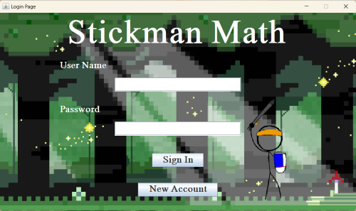
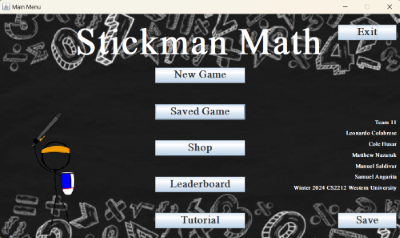
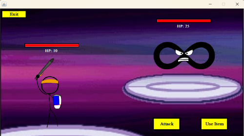
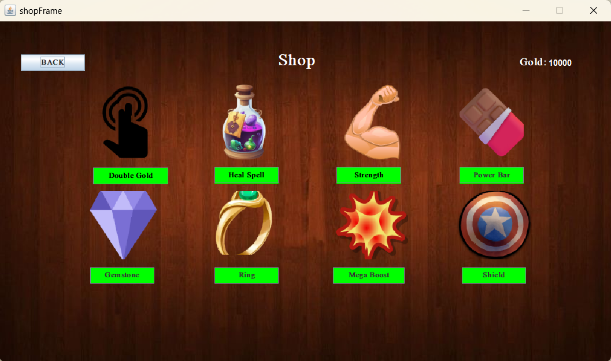

# 🎮 StickmanMath

**StickmanMath** is an **interactive and engaging educational combat-style Java game** designed to make learning fun for all ages. Players practice arithmetic skills while battling enemies in a dynamic math-based world.

Answer questions correctly to deal damage, earn coins, and progress, all while reinforcing key math skills in addition, subtraction, multiplication, and division. Built entirely in Java using Eclipse, the game uses CSV files to save user data and track game progress. It supports multiple account types: **Student**, **Teacher**, and **Developer**, each offering distinct gameplay or administrative roles.

Perfect for practicing math, monitoring student progress, or simply enjoying a creative twist on learning!

<p align="center">
  
  
  
  
</p>

---

## 🚀 Features

* 🧑‍🎓 **Student Accounts**: Access the full gameplay experience, track progress, earn coins, and purchase items.
* 👩‍🏫 **Teacher Accounts**: Add student usernames, view student progress, and access all student account features.
* 👨‍💻 **Developer Account**: Reserved for the creators — used to test and debug game features.
* ⚔️ **Combat-Style Learning**: Correct answers deal damage to enemies; wrong answers cause damage to the player.
* 🌍 **Five Math Worlds**:

  * Addition
  * Subtraction
  * Multiplication
  * Division
  * Final Level (Mixed)
* 🪙 **Coin System**: Earn coins by completing levels; spend them in the shop on helpful items.
* 🏅 **Leaderboard**: Track local progress across accounts.
* 💾 **Auto & Manual Save**: Progress is automatically saved at checkpoints, with a manual save option in the main menu.

---

## 🛠️ How to Run

1. **Clone or download the repository**.
2. Open **Terminal** or **Command Prompt** in the project folder.
3. Navigate to the `Code/` directory.
4. Compile and run the game:

   ```bash
   javac main.java
   java main
   ```

---

## 📁 File Structure

> All files are located inside the `Code/` folder, there are no subdirectories.

### Source Files

* `main.java`: Entry point of the game.

### CSV Files (must be stored **outside the JAR**, in the same folder)

* `Main_Game_File.csv`: Stores user data (username, password, account type, level progress, and inventory).
* `Classroom.csv`: Lists teachers and associated students (`Teacher, student1, student2, ...`).
* `equations.csv`: Stores all math questions used in-game.

### Assets

* `.png`, `.jpg`: Sprites and UI elements.
* `.wav`: Background music and sound effects.

---

## 🐞 Known Issues

* When exporting the game as a `.jar`, all `.csv` files **must remain outside the JAR** and be kept in the **same folder** as the executable.
* CSV files can be manually edited without running the game — this is not currently restricted.

---

## 🧩 Requirements

* Java JDK 8 or higher
* Compatible with Windows, macOS, and Linux (Java must be installed)

---

## 📝 Notes

* Developed entirely in **Java** using **Eclipse**.
* Game data is managed using **CSV files** (no external database).
* Save data is automatically updated but can also be saved manually from the main menu.

---

## 👥 Credits

* Game developed by: Samuel Angarita, Manuel Saldivar, Matthew Nazaruk, Cole Husar, Leonardo Colabrese.

---

## 🗺️ Roadmap / To-Do

* [ ] Secure CSV file access
* [ ] Add an online leaderboard
* [ ] Implement user profile customization
* [ ] Improve game balance and scaling

---

## 🔒 License

**Copyright © 2025**
Samuel Angarita, Manuel Saldivar, Matthew Nazaruk, Cole Husar, Leonardo Colabrese

All rights reserved.

This project and its source code are protected by copyright and may **not** be copied, modified, distributed, published, or used for commercial purposes without **explicit written permission** from the authors.

> Unauthorized use, reproduction, or sale of this game — including any of its code, assets, or design — is strictly prohibited and may result in legal action.

If you are interested in using this project for educational, showcase, or collaborative purposes, please contact the authors directly.

---
